<!-- v2 llama-benchy graph gallery - ALL charts on one page -->

# v2 throughput graphs — all charts

Full gallery for the v2 llama-benchy suite. 16 charts, split by KV cache
type (f16 / bf16). Each chart compares the three backends at one KV type:
**red = master, amber = boosts, blue = vulkan** (legend below every axis).

Conventions:
- **Prefill** (top row of each group): y origin at 0, wide range.
- **Decode** (bottom row): zoomed y-window (~17-30 t/s) so the tight
  ~1% backend separation is legible.
- **Depth axis**: sqrt-scaled, labeled with the real context depth
  (0K/4K/8K/16K/32K/64K/128K). Non-linear; sqrt spreads the shallow
  anchors while keeping the deep end readable.
- All lines solid; the KV type is in each title.

Methodology & numbers: [`benchy-methodology.md`](../benchy-methodology.md) ·
[`v2-results.md`](../v2-results.md). Generator:
[`make-v2-graphs.py`](../scripts/make-v2-graphs.py) (reads raw JSON, no
hardcoded values).

---

## 1 card — Q6_K (22.9 GB)

| f16 | bf16 |
|-----|------|
| 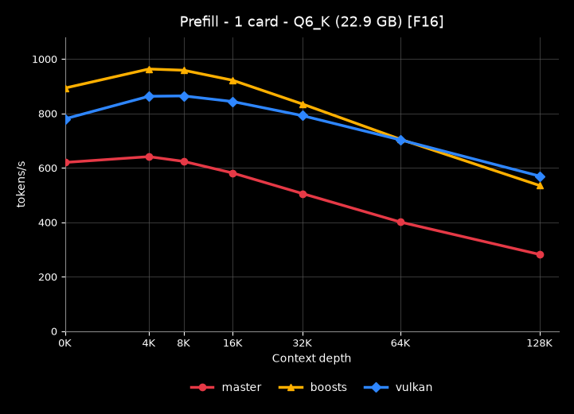 | 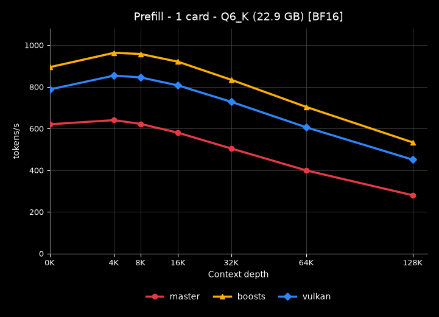 |
| 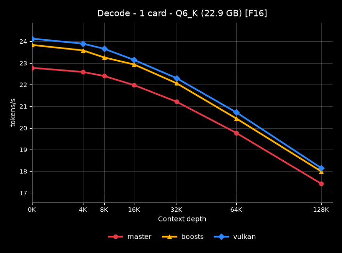 | 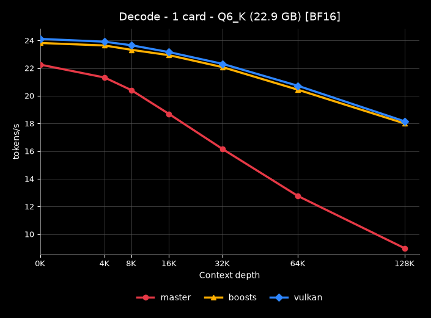 |

## 1 card — Q4_K_XL (17.6 GB)

| f16 | bf16 |
|-----|------|
| 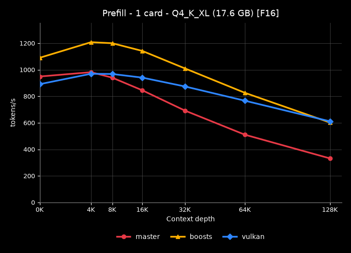 | 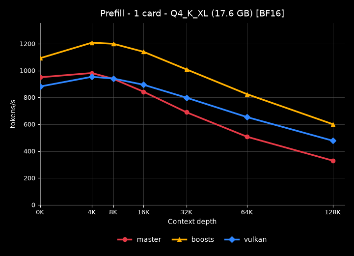 |
| 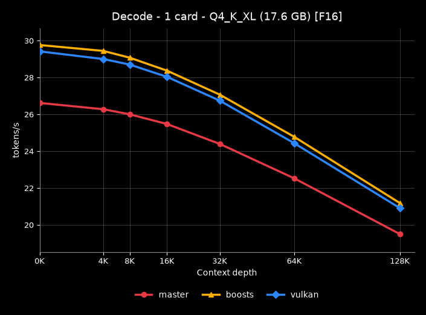 | 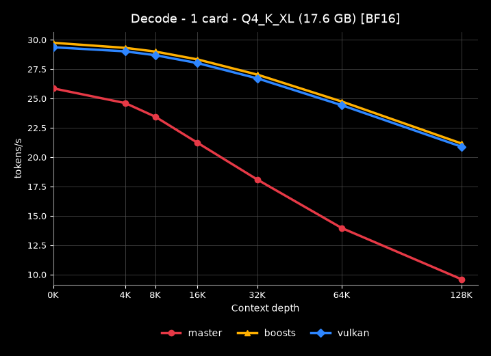 |

## 2 cards — Q8_0 (29 GB)

| f16 | bf16 |
|-----|------|
| 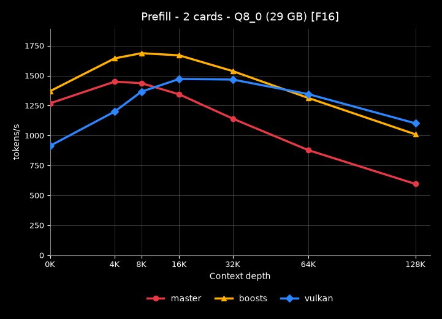 | 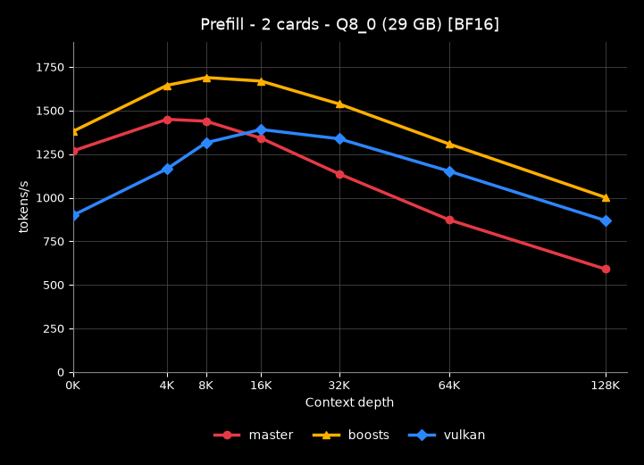 |
| 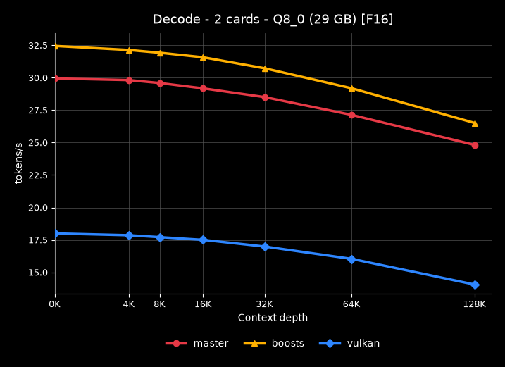 | 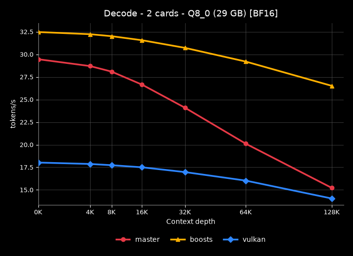 |

## 3 cards — Q8_0 (29 GB)

| f16 | bf16 |
|-----|------|
| 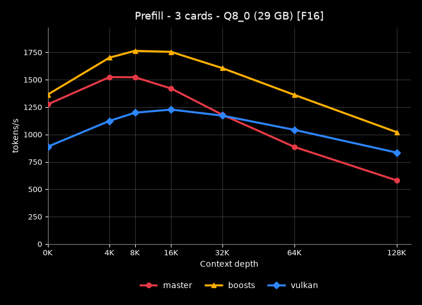 | 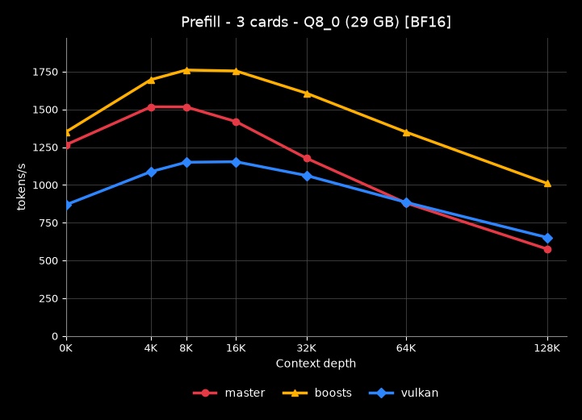 |
| 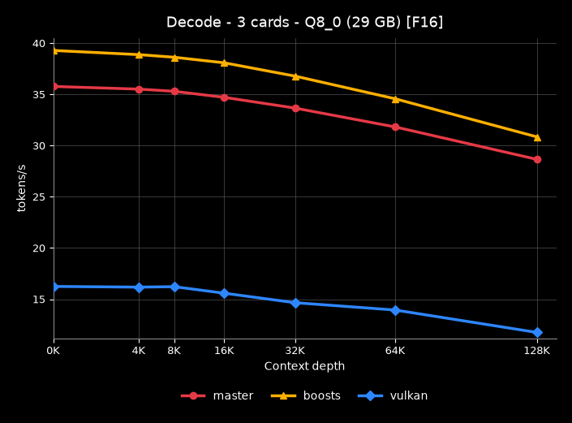 | 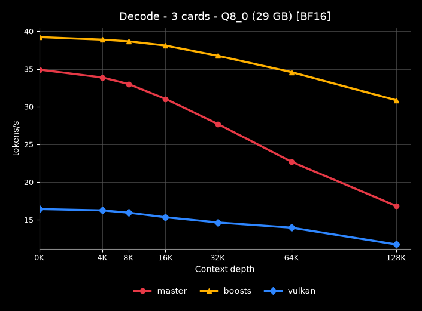 |
