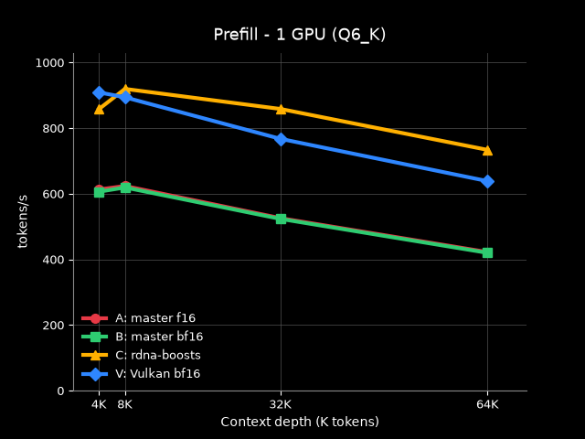
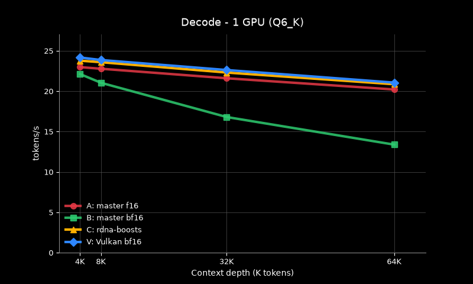
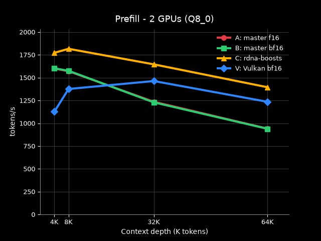
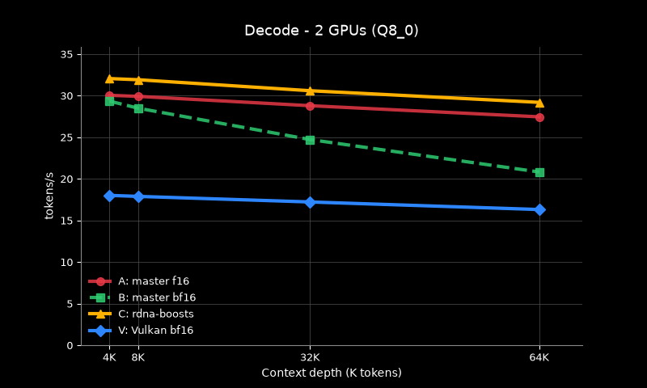
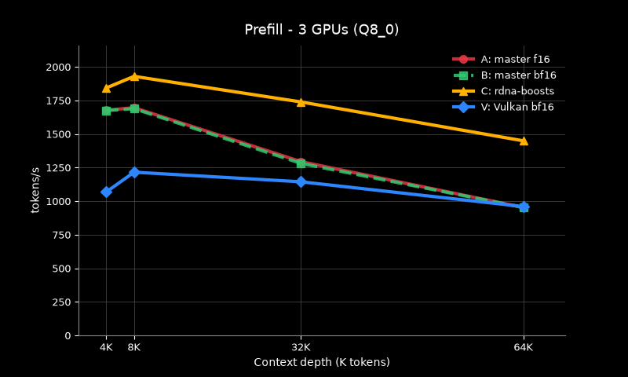
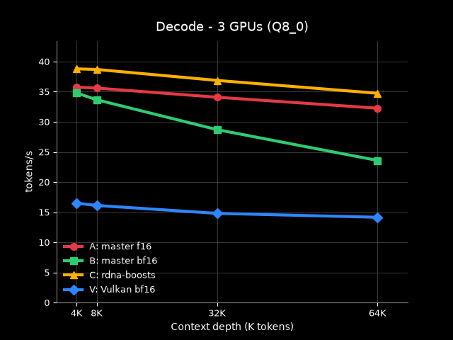

# Benchmark results: llama.cpp master vs rdna-boosts (v1, 2026-08-26)

> **This is the v1 record** (curl + `/completion` protocol). The current
> full results are the v2 llama-benchy live-server suite in
> **[v2-results.md](v2-results.md)** (24-row throughput gamut: 16 ROCm +
> 8 Vulkan, × f16/bf16 KV; 18 PPL corners). v1 is preserved here as the
> historical baseline.
>
> **v2 headline**: master ROCm BF16 decode penalty reaches −38 to −51% at
> 128K depth; boosts-bf16 is faster than master-f16 at every depth (+44–89%
> prefill, 1 card) AND more accurate (PPL lowest on every model); even
> boosts-f16 beats master-f16 at the same KV type. Vulkan (genuine native
> BF16) has superb single-card prefill but its decode collapses on
> multi-card and its BF16 costs prefill at depth.
>
> v1 protocol: [methodology.md](methodology.md) · v2 protocol:
> [benchy-methodology.md](benchy-methodology.md).

Date: 2026-08-26
Machine: 3x Radeon R9700 (gfx1201, 34 GB, ~640 MB/s each), ROCm 7.14
Model: Qwen3.8-27B - Q8_0 (29 GB) for the 2c/3c rows, Q6_K (22.9 GB) for the
1c rows; the full BF16 weights are covered in their own section.

Configs under test (full protocol in [methodology.md](methodology.md)):

| label | build | KV cache | note |
|-------|-------|----------|------|
| A | master `d222767c7` | FP16 | upstream baseline |
| B | master `d222767c7` | BF16 | silently FP16 (master ROCm has no native BF16 KV) + per-token conversion cost |
| C | rdna-boosts (11 blocks) | BF16 | native BF16 KV + FP32-accumulate attention (block 03) |
| V | master, Vulkan backend | BF16 | native BF16 KV on Vulkan (different backend end-to-end) |

## Headline numbers

- **Prefill**: C beats A by +33% (32K, 2 cards) up to +74% (64K, 1 card);
  the fork's edge grows with depth because BF16 halves the attention KV
  traffic. Peak prefill anywhere: **1930 t/s** (8K depth, 3 cards, +13.8%).
- **Decode**: C beats A by +6-9% on 2-3 GPUs (+3-4% on the single card),
  roughly constant across depths.
- **B's silent-FP16 penalty** (decode): -2% (4K) to -34% (64K, 1 card),
  growing with depth and bandwidth pressure. B's prefill is indistinguishable
  from A's.
- **PPL**: a statistical wash - every config within +/-0.04 error bars at
  both resolutions, directionally in C's favor (full-corpus ladder below).
- **3-card scaling**: ROCm decode +17-20% going 2 -> 3 cards
  (bandwidth-bound), prefill +1-6%; Vulkan scales negatively on both axes
  (layer-split sync).

## Throughput

The tables are grouped by GPU count; within each, the backend is on the
left and the context depth runs along the top (4K/8K/32K/64K). The 1-GPU
table uses the Q6_K model (22.9 GB) on a single 640 MB/s card; the 2- and
3-GPU tables use Q8_0 (29 GB). ROCm runs use tensor split, Vulkan uses
layer split (Vulkan has no tensor split). Values are means of 1-2 rounds,
stable to <1%.

### 1 GPU (Q6_K weights, 22.9 GB, 640 MB/s single card)

**Prefill (t/s)**

| Backend / KV Quant | 4K | 8K | 32K | 64K |
|---------|-----|-----|------|------|
| Master ROCm/FP16 | 613.3 | 623.9 | 525.9 | 422.4 |
| Master ROCm/BF16 | 606.5 | 619.4 | 523.6 | 420.1 |
| RDNA-Boosts/BF16 | 858.5 | **919.8** | **858.7** | **733.9** |
| Vulkan/BF16 | **909.1** | 894.2 | 767.7 | 638.7 |
| **Boosts/BF16 vs ROCm/FP16** | +40.0% | +47.4% | +63.3% | +73.7% |

**Decode (t/s)**

| Backend / KV Quant | 4K | 8K | 32K | 64K |
|---------|-----|-----|------|------|
| Master ROCm/FP16 | 22.99 | 22.79 | 21.61 | 20.22 |
| Master ROCm/BF16 | 22.13 | 21.05 | 16.81 | 13.39 |
| RDNA-Boosts/BF16 | 23.79 | 23.60 | 22.32 | 20.87 |
| Vulkan/BF16 | **24.18** | **23.87** | **22.63** | **21.07** |
| **Boosts/BF16 vs ROCm/FP16** | +3.5% | +3.6% | +3.3% | +3.2% |
| **ROCm/BF16 vs ROCm/FP16** | -3.7% | -7.6% | -22.2% | -33.8% |

### 2 GPUs (Q8_0 weights, 29 GB, tensor split)

**Prefill (t/s)**

| Backend / KV Quant | 4K | 8K | 32K | 64K |
|---------|-----|-----|------|------|
| Master ROCm/FP16 | 1600.2 | 1570.6 | 1235.8 | 941.4 |
| Master ROCm/BF16 | 1602.8 | 1575.4 | 1229.3 | 939.3 |
| RDNA-Boosts/BF16 | **1772.4** | **1816.5** | **1645.9** | **1395.0** |
| Vulkan/BF16 | 1126.8 | 1376.1 | 1463.0 | 1235.2 |
| **Boosts/BF16 vs ROCm/FP16** | +10.8% | +15.7% | +33.2% | +48.2% |

**Decode (t/s)**

| Backend / KV Quant | 4K | 8K | 32K | 64K |
|---------|-----|-----|------|------|
| Master ROCm/FP16 | 30.05 | 29.92 | 28.80 | 27.46 |
| Master ROCm/BF16 | 29.35 | 28.50 | 24.73 | 20.83 |
| RDNA-Boosts/BF16 | **32.06** | **31.92** | **30.60** | **29.20** |
| Vulkan/BF16 | 18.02 | 17.90 | 17.23 | 16.32 |
| **Boosts/BF16 vs ROCm/FP16** | +6.7% | +6.7% | +6.3% | +6.3% |
| **ROCm/BF16 vs ROCm/FP16** | -2.3% | -4.7% | -14.1% | -24.1% |

### 3 GPUs (Q8_0 weights, 29 GB, tensor split)

**Prefill (t/s)**

| Backend / KV Quant | 4K | 8K | 32K | 64K |
|---------|-----|-----|------|------|
| Master ROCm/FP16 | 1678.1 | 1696.7 | 1295.1 | 953.5 |
| Master ROCm/BF16 | 1675.5 | 1689.4 | 1281.9 | 953.2 |
| RDNA-Boosts/BF16 | **1843.9** | **1930.2** | **1739.6** | **1449.8** |
| Vulkan/BF16 | 1069.4 | 1216.6 | 1144.9 | 960.4 |
| **Boosts/BF16 vs ROCm/FP16** | +9.9% | +13.8% | +34.3% | +52.1% |

**Decode (t/s)**

| Backend / KV Quant | 4K | 8K | 32K | 64K |
|---------|-----|-----|------|------|
| Master ROCm/FP16 | 35.75 | 35.60 | 34.08 | 32.26 |
| Master ROCm/BF16 | 34.78 | 33.66 | 28.70 | 23.59 |
| RDNA-Boosts/BF16 | **38.79** | **38.69** | **36.87** | **34.74** |
| Vulkan/BF16 | 16.50 | 16.12 | 14.81 | 14.16 |
| **Boosts/BF16 vs ROCm/FP16** | +8.5% | +8.7% | +8.2% | +7.7% |
| **ROCm/BF16 vs ROCm/FP16** | -2.7% | -5.5% | -15.8% | -26.9% |

### Reading the throughput tables

- **The fork's prefill edge grows with depth**: +10-16% at 4K/8K (2c) ->
  +33-34% at 32K -> +48-52% at 64K, and +40-74% on the single slow card. The
  BF16 KV halves the attention read traffic, and prefill re-reads the growing
  cache for every batch - so the deeper the context, the bigger the win.
  Prefill falls off roughly half as fast with depth on C (2c: -21% to 64K vs
  A's -41%).
- **8K is the prefill peak** for both backends on 3 cards (A: 1678 @ 4K ->
  1696.7 @ 8K -> 953 @ 64K; C: 1844 @ 4K -> 1930.2 @ 8K -> 1450 @ 64K).
- **B's decode penalty is small and shallow, brutal at depth**: -2 to -8%
  at 4K/8K, -14 to -16% at 32K, -24 to -27% at 64K (2c/3c), and -34% on the
  single card at 64K. The per-token FP16 conversion cost scales with KV
  traffic. B's prefill is unaffected (it is compute-bound, not conversion
  bound).
- **C's decode edge is roughly constant rather than growing**: +6-9% on
  2-3 GPUs, +3-4% on the single card. Decode touches only the final KV
  depth, so the BF16 advantage does not compound with depth the way
  prefill's does.
- **Vulkan**: prefill beats master ROCm on 1 GPU at every depth (+43-51%)
  and on 2 GPUs at 32K/64K (+18-31%), but loses at shallow multi-GPU
  (4K: -30% 2c, -36% 3c) and at 3 GPUs even at depth (32K: -12%; 64K:
  ~tie) where the layer-split sync dominates. Its prefill never beats the
  fork's ROCm BF16. Decode collapses on multi-GPU (17.23 2c / 14.81 3c at
  32K; 14.16-16.32 at 64K) but matches or slightly beats C on 1 GPU
  (+1-2%, a recent upstream Vulkan improvement).
- **Multi-card scaling, 2 -> 3 cards** (Q8_0):

  | config | prefill (32K / 64K) | decode (32K / 64K) |
  |--------|----------------------|--------------------|
  | A | +4.8% / +1.3% | +18.3% / +17.5% |
  | C | +5.7% / +3.9% | +20.5% / +19.0% |
  | V | -21.7% / -22.2% | -14.0% / -13.2% |

  ROCm decode is bandwidth-bound and a third card adds bandwidth (+17-20%);
  prefill is compute/latency-bound and barely scales (+1-6%). Vulkan scales
  negatively on both axes. vLLM cannot span 3 GPUs with a single model;
  llama.cpp (ROCm) can - the 3-card row is the interesting one for serving
  comparisons.

### Full BF16 weights, 3 cards (fork build, BF16 KV)

| depth | prefill | decode |
|-------|---------|--------|
| 4K | 1282.1 t/s | 23.56 t/s |
| 32K | 1571.1 t/s | 22.75 t/s |
| 64K | 1348.6 t/s | 21.95 t/s |

vs the Q8_0 fork on 3 cards (1844/1740/1450 prefill, 38.8/36.9/34.7 decode):
decode ~37-39% slower (weight-bandwidth bound, 54 GB vs 29 GB), prefill
7-30% slower. Combined with the PPL result (Q8_0 costs nothing measurable),
the full BF16 weights buy no PPL and cost ~1.65x decode: not competitive for
serving; Q8_0 is the right production choice.

## Perplexity (wikitext-2 test, -c 2048, flash-attn on)

### 128 chunks x 2048 ctx

| config | build | backend | KV | PPL | vs C |
|--------|-------|---------|-----|-----|------|
| A | master | ROCm | FP16 | 6.3193 +/- 0.04262 | +0.0031 |
| B | master | ROCm | BF16 (silent FP16) | 6.3213 +/- 0.04264 | +0.0051 |
| C | rdna-boosts | ROCm | BF16 | **6.3162** +/- 0.04264 | - |
| V | master | Vulkan | BF16 (native) | 6.3293 +/- 0.04284 | +0.0131 |

All four within their +/-0.043 error bars - the ordering is directional, not
conclusive. Notes:
- B equals A: master's ROCm BF16 is FP16 in disguise, so it carries FP16's PPL.
- V is the reference for a *true* native BF16 KV (master's Vulkan backend
  really stores BF16, unlike master's ROCm path). It comes out highest;
  caveat: V is a different backend end-to-end (Vulkan dequant and attention
  kernels have their own numerics), so the delta is not purely the KV type.
- C is the lowest: the fork's BF16 does not trade PPL for speed against any
  reference.
- The BF16-weight (FP32 KV) ground truth did NOT land below the Q8_0 set:
  mainline BF16+FP32 6.3212, fork BF16+FP32 6.3220. The Q8_0 quants are
  imatrix-calibrated and wikitext-2 at 128x2048 is an easy protocol, so the
  quantization cost is below statistical resolution. Honest reading: Q8_0 is
  effectively free here, and the fork's BF16 KV does not trade PPL against
  anything, including full precision.
- The fork build on BF16 weights matches mainline exactly (6.3220 vs
  6.3212): the rdna-boosts pipeline does not change the model's numerics.

### Full corpus (the maximal resolution)

The test set is ~152 chunks at 2048 ctx, so the 500-chunk request exceeded
the corpus and these runs covered the entire test set. Harder trailing chunks
raise the absolute PPL by ~0.04 for every config; the error bars barely
shrink because per-chunk loss variance dominates.

| config | full corpus PPL |
|--------|-----------------|
| fork Q8_0 BF16, chunked FP32 | **6.3561** +/- 0.0406 |
| fork Q8_0 BF16, chunked BF16 (default) | 6.3563 +/- 0.0406 |
| fork Q8_0 BF16, sequential GDN | 6.3576 +/- 0.0406 |
| mainline BF16 + FP32 KV (ground truth) | 6.3595 +/- 0.0406 |
| mainline Q8_0 FP16 (config A) | 6.3619 +/- 0.0406 |
| mainline Vulkan Q8_0 BF16 (config V) | 6.3678 +/- 0.0407 |

Same ordering as the 128-chunk runs, now at full-corpus resolution:
- GDN dispatch trio spread 0.0015: the chunked GDN rewrite and its BF16
  tensor-core path are PPL-neutral (see the dispatch matrix below).
- All three Q8_0 forks sit at or below the BF16 full-precision ground truth
  by 0.002-0.003: calibrated Q8_0 quants are effectively free.
- Directional only: same weights, same ROCm backend, the fork's BF16 KV
  (6.3563) is 0.006 better than mainline's FP16 KV (6.3619), and Vulkan's
  attention numerics land last.

### GDN dispatch matrix (fork, Q8_0, BF16 KV, 2 cards, 128 chunks)

Hypothesis: the chunked GDN rewrite (or its BF16 tensor-core path) is the
source of the small PPL spread. Tested by forcing the alternate dispatches:

| GDN path | env | PPL |
|----------|-----|-----|
| chunked BF16 (default, S_v=128) | - | 6.3162 |
| chunked FP32 | `GGML_CUDA_GDN_CHUNKED_BF16=0` | **6.3144** |
| sequential (non-chunked) | `GGML_CUDA_GDN_CHUNKED=0` | 6.3177 |

Spread 0.0033, all within +/-0.043: neither the chunking nor the BF16
tensor-core path is a measurable PPL variance source. (The FP32 chunked path
happens to land lowest; that is not significant.)

## Analysis

### Why Vulkan BF16 sits at the top of the PPL range

Every config uses the same Q8_0 model, so the ordering is driven by the
attention/KV pipeline numerics:

- **fork (C)**: BF16 KV storage (7 mantissa bits), full FP32 attention math
- **mainline FP16 (A)**: FP16 KV storage (10 mantissa bits), FP32 attention math
- **Vulkan (V)**: BF16 KV storage (7 bits), fp16-rounding at the attention

Investigation findings (master, ggml-vulkan):
- The R9700 (RADV gfx1201) exposes VK_KHR_cooperative_matrix +
  VK_NV_cooperative_matrix2, and the build compiles the BF16 coopmat2
  shaders (GGML_VULKAN_BFLOAT16_GLSLC_SUPPORT=ON), so BF16 KV dispatches
  the cooperative-matrix (tensor-core) flash attention.
- The BF16 coopmat2 variant (fa_BF16_dict: FLOAT_TYPE=bfloat16_t,
  BFLOAT16=1, GL_EXT_bfloat16) reads K/V natively as bfloat16_t straight
  into coopmat<bfloat16_t,...> (raw uint8_t buffers, no dequant), and
  rounds Q (FP32) to BF16 for the tensor core. QK^T/PV run as BF16 x BF16
  -> FP32 tensor-core ops with FP32 softmax (ACC_TYPE=float). The fp16
  rounding (faDecodeK -> float16_t) applies only to the FP16/quantized K/V
  variants, not BF16.
- So Vulkan's BF16 attention operates at 7-bit mantissa precision
  EVERYWHERE: BF16 KV storage, BF16 Q, BF16 tensor cores (FP32 accumulate).
  The ROCm paths keep Q and the attention math in FP32 (fork: BF16 KV only;
  mainline: FP16 KV, 10-bit mantissa, FP32 math). Vulkan's is the lowest-
  precision attention of the three - the plausible mechanism for its
  consistent position at the top (worst) of the range: ~0.006 PPL over
  mainline FP16 and ~0.012 over the fork, all within the +/-0.04 error bars.
- Precision table (attention pipeline):

  | config | KV storage | Q at attention | attention math |
  |--------|-----------|----------------|----------------|
  | A/B mainline | FP16 (10 bits) | FP32 | FP32 (B silently = A) |
  | C fork | BF16 (7 bits) | FP32 | FP32 |
  | V Vulkan | BF16 (7 bits) | BF16 | BF16 tensor cores, FP32 acc |

  Note the ordering does NOT reduce to "KV mantissa bits" alone: A's FP16 KV
  has more mantissa bits than C's BF16 KV, yet C measures better - so the
  fork-vs-mainline gap comes from other numerics (GDN rewrite, attention
  implementation), not KV precision. All within +/-0.04 error bars.

### Why the BF16+FP32 "ground truth" did not top the ladder

The full-precision config (BF16 weights, FP32 KV) measured mid-pack
(6.3595 full corpus), below the fork's Q8_0 configs. Three stacked reasons:

1. The BF16 weights are themselves quantized - 7-bit mantissa (the model's
   native format). The config carries the same mantissa quantization as the
   fork's BF16 KV.
2. Imatrix-calibrated Q8_0 (8-bit mantissa + per-block FP32 scale, scales
   tuned to the activation distribution) can approximate the original FP32
   weights BETTER than the BF16 line does. Calibrated quants occasionally
   beating the half-precision "ground truth" is expected when the
   quantization noise is smaller than the BF16 representation error.
3. The FP32 KV bought nothing - KV precision is not a PPL lever on this model
   at this protocol (BF16 = FP16 = FP32 KV within noise, proven across every
   config).

The mid-pack landing is the strongest endorsement of the fork: the fastest
config is statistically indistinguishable from the most precise config
runnable (0.003 apart, direction inconsistent, +/-0.04 bars). Config nuance:
the ground truth ran 3-card layer split (mainline aborts on tensor split) vs
the forks' 2-card tensor split - numerics-equivalent per-op, only
cross-device reduction order differs.

### Fork KV design rationale (C)

The fork's KV design is a conscious trade: compute the attention with an FP32
accumulator end-to-end and round to BF16 ONLY at the cache boundary (the K/V
projection output). This sacrifices ~3 mantissa bits vs an fp16-cached path
(10 bits), but keeps the full FP32 exponent range in the accumulation. On
this model the range property wins: C's BF16+FP32 path measures at-or-below
every fp16-based config at every resolution (6.3563 full-corpus vs A's FP16
6.3619), and its prefill edge grows with depth because BF16 halves the KV
traffic. The fp16-vs-BF16 storage choice is model-dependent in principle
(models with small-magnitude attention states might prefer fp16's mantissa);
empirically, on Qwen3.8-27B at this protocol, BF16 storage costs nothing
measurable.

Exonerated along the way:
- The scalar (non-coopmat) FA BF16 variant dequantizes BF16 -> FP32 with
  FP32 accumulate (FA_DEQUANT4_BF16 + forced FP32acc) - fully precise.
- The Vulkan gated_delta_net kernels are pure FP32 (FLOAT_TYPE=float).
- The FP32 -> BF16 KV cache write uses round-to-nearest-even, identical to
  ggml_compute_FP32_to_BF16.
- The Q8_0 GEMM inputs are fp16 on both backends (tensor-core dequant) -
  not a differentiator.

Caveat: if a build/device lacks BF16 matrix-core support, BF16 KV falls
back to the scalar FP32 FA (precise) and the penalty would then come only
from the 7-bit vs 10-bit KV storage difference. The measured direction is
the same either way.
